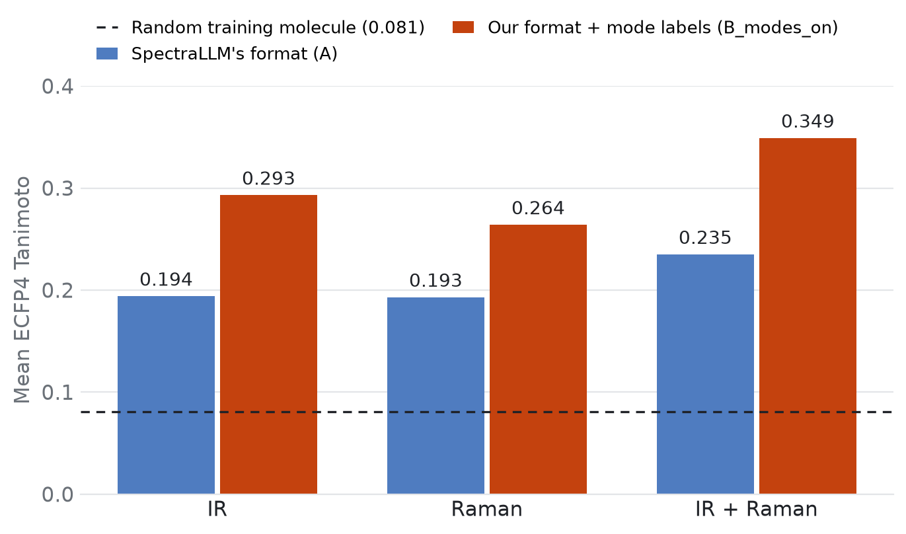

# spectral tokenisers

**Does a richer text format help a language model read a spectrum?**
A controlled comparison of two ways of writing IR and Raman spectra as text, for predicting molecular structure with a fine-tuned LLM, on the QM9S benchmark used by [SpectraLLM](https://arxiv.org/abs/2508.08441).

## Result

Four models were trained that differ only in how the spectrum is written as text. Scores are mean ECFP4 Tanimoto similarity between the predicted and the true molecule on 1,000 held-out molecules (0.081 for a random training molecule, 1.0 for a perfect prediction).



*Figure 1. SpectraLLM's format (A) against our format with mode labels (B_modes_on). On IR+Raman, similarity rises from 0.235 to 0.349 (+49%) and exact matches from 1.8% to 8.1%. Validity falls from 99.1% to 97.3%.*


*Figure 2. All four arms. Three score about the same; only the arm with mode labels stands apart.*

1. **The format alone slightly helps.** Our structured format without mode labels beats SpectraLLM's layout by +0.012 on IR+Raman (95% interval +0.0004 to +0.023). Exact match is unchanged at 1.8%.
2. **Vibrational mode labels help a lot.** Adding a mode label to each peak gives +0.102 (a 41% increase over the format without labels) and raises exact match from 1.8% to 8.1% (4.5 times). About 90% of the total gain comes from the labels.
3. **The labels carry information a spectrum alone does not.** They are derived from each molecule's DFT Hessian. So result 2 measures what correct peak assignments are worth to the model, not how much more the model extracts from the spectrum, rather how priors can help generate more useful representations.
4. **Reading the IR axis in reverse costs nothing.** SpectraLLM's released preprocessing assigns the IR axis in the opposite direction to the QM9S file. Reproducing that exactly changes the score by +0.002 (95% interval −0.009 to +0.012). A fine-tuned model learns whatever consistent mapping it is given so all good.

### Decomposition of the gain (IR+Raman, primary condition)

| Step | Comparison | Gain | 95% interval |
|---|---|---|---|
| Change the format only | `B_modes_off` − `A` | +0.012 | +0.0004 to +0.023 |
| Add mode labels | `B_modes_on` − `B_modes_off` | +0.102 | +0.087 to +0.118 |
| Total | `B_modes_on` − `A` | +0.114 | +0.098 to +0.130 |

### Scores for every arm

Every metric for each arm and each kind of spectrum. Higher is better except MCES, which counts the bond edits between the predicted and the true molecule. "Groups" is the overlap in functional groups.

| Spectra | Arm | Validity | Tanimoto | Cosine | MCES ↓ | Groups | MACCS | Fraggle | Exact |
|---|---|---|---|---|---|---|---|---|---|
| IR | `A_native` | 99.3% | 0.190 | 0.309 | 6.79 | 0.728 | 0.447 | 0.525 | 0.6% |
| IR | `A` | 99.1% | 0.194 | 0.314 | 6.68 | 0.726 | 0.456 | 0.529 | 0.7% |
| IR | `B_modes_off` | 99.0% | 0.199 | 0.322 | 6.59 | 0.736 | 0.465 | 0.539 | 0.5% |
| IR | `B_modes_on` | 97.8% | **0.293** | **0.428** | **4.57** | **0.845** | **0.631** | **0.616** | **4.7%** |
| Raman | `A_native` | 98.6% | 0.197 | 0.317 | 6.77 | 0.713 | 0.452 | 0.500 | 0.9% |
| Raman | `A` | 98.4% | 0.193 | 0.312 | 6.79 | 0.710 | 0.451 | 0.525 | 0.7% |
| Raman | `B_modes_off` | 98.8% | 0.201 | 0.320 | 6.71 | 0.725 | 0.457 | 0.516 | 1.1% |
| Raman | `B_modes_on` | 97.8% | **0.264** | **0.396** | **5.68** | **0.752** | **0.540** | **0.584** | **2.9%** |
| IR+Raman | `A_native` | 99.3% | 0.233 | 0.363 | 5.90 | 0.813 | 0.526 | 0.605 | 1.7% |
| IR+Raman | `A` | 99.1% | 0.235 | 0.364 | 5.78 | 0.811 | 0.523 | 0.583 | 1.8% |
| IR+Raman | `B_modes_off` | 98.9% | 0.247 | 0.379 | 5.58 | 0.826 | 0.546 | 0.602 | 1.8% |
| IR+Raman | `B_modes_on` | 97.3% | **0.349** | **0.484** | **3.95** | **0.893** | **0.686** | **0.657** | **8.1%** |

n = 1,000 per row; sampling decoding; an invalid output scores 0. A random training molecule scores Tanimoto 0.081 and MCES 10.35. The Fraggle ceiling is 0.834, because RDKit returns 0 for molecules too small to fragment.

**What it shows.** `B_modes_on` is best on every similarity metric for every kind of spectrum, and has the lowest validity in each. The other three arms are within 0.015 Tanimoto of each other.

### Paired differences in Tanimoto

Each row compares two arms on the same 1,000 molecules. The interval is the plausible range for the true average difference; the p-value is from a Wilcoxon signed-rank test, which looks at ranks, so the two can disagree for small differences.

| Comparison (X − Y) | Spectra | X | Y | Difference | 95% interval | p-value |
|---|---|---|---|---|---|---|
| `B_modes_on` − `A` | IR | 0.293 | 0.194 | +0.099 | +0.086 to +0.112 | 3 × 10⁻⁶¹ |
| `B_modes_on` − `A` | Raman | 0.264 | 0.193 | +0.071 | +0.060 to +0.082 | 3 × 10⁻⁴³ |
| `B_modes_on` − `A` | IR+Raman | 0.349 | 0.235 | +0.114 | +0.098 to +0.130 | 9 × 10⁻⁵⁶ |
| `B_modes_off` − `A` | IR | 0.199 | 0.194 | +0.005 | −0.003 to +0.014 | 0.022 |
| `B_modes_off` − `A` | Raman | 0.201 | 0.193 | +0.007 | −0.001 to +0.016 | 0.17 |
| `B_modes_off` − `A` | IR+Raman | 0.247 | 0.235 | +0.012 | +0.0004 to +0.023 | 0.0019 |
| `B_modes_on` − `B_modes_off` | IR | 0.293 | 0.199 | +0.094 | +0.081 to +0.107 | 1 × 10⁻⁵³ |
| `B_modes_on` − `B_modes_off` | Raman | 0.264 | 0.201 | +0.064 | +0.052 to +0.075 | 2 × 10⁻³⁴ |
| `B_modes_on` − `B_modes_off` | IR+Raman | 0.349 | 0.247 | +0.102 | +0.087 to +0.118 | 3 × 10⁻⁴³ |
| `A` − `A_native` | IR | 0.194 | 0.190 | +0.004 | −0.004 to +0.013 | 0.21 |
| `A` − `A_native` | Raman | 0.193 | 0.197 | −0.004 | −0.012 to +0.004 | 0.12 |
| `A` − `A_native` | IR+Raman | 0.235 | 0.233 | +0.002 | −0.009 to +0.012 | 0.68 |

Bootstrap intervals use 10,000 resamples. One training run per arm, so the intervals do not include variation between seeds.

**What it shows.** Adding mode labels gives a gain of 0.06 to 0.10 whose interval is far from zero for every kind of spectrum. Changing only the format gives at most 0.012, and its interval includes zero for IR alone and for Raman alone. Correcting SpectraLLM's IR axis makes no detectable difference.

## Design

Comparing a small run against SpectraLLM's published numbers would mostly measure scale: they trained a 32B model on about 105,000 molecules. Here every arm uses the same base model, molecules, splits, training settings, batch order, decoding and metrics. Only the text changes.

| Arm | What the model is given |
|---|---|
| `A_native` | SpectraLLM's released pipeline reproduced exactly, including its IR axis |
| `A` | SpectraLLM's text layout on a shared peak list, IR axis as in the QM9S file |
| `B_modes_off` | Our format (`components_v3`) on the same peaks |
| `B_modes_on` | `components_v3` with a vibrational mode label on each peak |

- **Clean test of the format:** `A` against `B_modes_off`.
- **Value of mode labels:** `B_modes_on` against `B_modes_off`.
- **Effect of the released pipeline's axis and peak settings:** `A_native` against `A`.

`components_v3` writes each peak as a structured record and adds derived features: peak counts in 250 cm⁻¹ windows, a relative intensity band per peak, and the start and end of each peak. It has 23 fields, of which 18 are not in SpectraLLM's format.

### Data

- **Source.** [QM9S](https://www.nature.com/articles/s43588-023-00550-y): 129,817 small organic molecules with DFT-computed IR and Raman spectra. 122,633 pass checks on chemistry, geometry and duplicates.
- **Splits.** 1,000 test, 500 validation and 10,000 training molecules, stratified by heavy-atom count and 17 functional groups. Split by molecule.
- **Aligned with SpectraLLM's split.** Test and validation molecules come from their test set and training molecules from their training set.
- **Targets.** Stereo-free canonical SMILES, matching SpectraLLM's convention.
- **Prompts.** 188,400 across 4 arms, 3 conditions (IR, Raman, IR+Raman) and all splits.

### Mode labels without new DFT

QM9S ships the Hessian for every molecule. Each Hessian is written as an ORCA Hessian file and passed to the ORCA PED Analyzer, and each mode is matched to a peak.

- The analyzer succeeded for 11,349 of 11,700 molecules.
- 97% of peaks received a label (160,330 IR peaks, 92,728 Raman peaks).
- Its frequencies agree with an independent diagonalisation to 0.000 cm⁻¹ over 552,773 modes.
- Spectra rebuilt from the DFT modes reproduce the QM9S files: IR median correlation 0.9999, Raman 0.949 (frequency scale 0.965).

### Training and evaluation

- **Model.** Qwen3-8B with LoRA (rank 16, alpha 32, all attention and MLP projections).
- **Schedule.** Learning rate 1e-4, 5% warm-up then cosine decay, 3 epochs, effective batch 16. Loss on the answer tokens only.
- **Identical batches.** Batch *k* of each epoch contains the same molecules and conditions in every arm.
- **Decoding.** Temperature 0.6, top-k 20, top-p 0.95, one sample per molecule. Greedy decoding gives the same picture (`B_modes_on` on IR+Raman: 0.356 against 0.349).
- **Metrics.** SpectraLLM's seven metrics, reimplemented. Primary: ECFP4 Tanimoto (Morgan radius 2, 2,048 bits) on IR+Raman. Invalid outputs count as 0.
- **Statistics.** Per-molecule paired differences, paired bootstrap with 10,000 resamples, Wilcoxon signed-rank tests.

### Cost

`components_v3` prompts are 2.2 to 3.2 times longer than SpectraLLM's.

| Arm | IR | Raman | IR+Raman |
|---|---|---|---|
| `A` | 333 | 263 | 479 |
| `A_native` | 414 | 301 | 599 |
| `B_modes_off` | 757 | 585 | 1,157 |
| `B_modes_on` | 1,018 | 703 | 1,518 |

Mean tokens per example on the test set (Qwen3 tokenizer; system prompt, prompt and answer).

## Limitations

- **One training run per arm.** The intervals cover variation between molecules, not between seeds. That hardly matters for the 0.10 gain from mode labels. It does matter for the 0.012 format-only gain, which should not be claimed without more seeds.
- **Training was not finished.** All four arms were still improving at epoch 3, so absolute scores are probably underestimates.
- **Absolute accuracy is low.** The best arm gets the exact molecule 8% of the time.
- **Mode labels need a source.** On experimental spectra they would have to come from somewhere other than the molecule's own Hessian, and would be less complete and less accurate.
- **No formal pre-registration.** The primary metric was named in the project roadmap before test predictions were generated.

## Against SpectraLLM's published numbers

For orientation only: the test molecules, model size and training data all differ. Published rows are copied from the SpectraLLM paper. Every row here follows the paper's convention of averaging similarity over valid outputs only, so our numbers differ slightly from the tables above.

### Single spectra

SpectraLLM reports two figures for each spectrum type: one model tested on each type (their Table 4), and a separate model retrained for that type alone (their Table 19).

| Spectra | Source | Validity | Tanimoto | Cosine | MCES ↓ | Groups | MACCS | Fraggle |
|---|---|---|---|---|---|---|---|---|
| IR | SpectraLLM, one model (Table 4) | 99.82% | 0.1921 | 0.3120 | 7.5651 | 0.6599 | 0.4330 | 0.3194 |
| IR | SpectraLLM, IR-only model (Table 19) | 100.00% | 0.1474 | 0.2462 | 7.1245 | 0.5309 | 0.3436 | 0.2686 |
| IR | Ours: `A_native` | 99.3% | 0.191 | 0.311 | 6.79 | 0.733 | 0.451 | 0.529 |
| IR | Ours: `A` | 99.1% | 0.195 | 0.317 | 6.68 | 0.733 | 0.460 | 0.533 |
| IR | Ours: `B_modes_off` | 99.0% | 0.201 | 0.325 | 6.59 | 0.744 | 0.470 | 0.545 |
| IR | Ours: `B_modes_on` | 97.8% | 0.299 | 0.437 | 4.57 | 0.864 | 0.646 | 0.630 |
| Raman | SpectraLLM, one model (Table 4) | 99.08% | 0.2500 | 0.3786 | 6.4076 | 0.7317 | 0.5071 | 0.2500 |
| Raman | SpectraLLM, Raman-only model (Table 19) | 98.90% | 0.3251 | 0.4490 | 5.4009 | 0.7986 | 0.5748 | 0.3958 |
| Raman | Ours: `A_native` | 98.6% | 0.200 | 0.321 | 6.77 | 0.723 | 0.459 | 0.507 |
| Raman | Ours: `A` | 98.4% | 0.196 | 0.317 | 6.79 | 0.721 | 0.458 | 0.533 |
| Raman | Ours: `B_modes_off` | 98.8% | 0.203 | 0.324 | 6.71 | 0.733 | 0.462 | 0.523 |
| Raman | Ours: `B_modes_on` | 97.8% | 0.270 | 0.405 | 5.68 | 0.768 | 0.552 | 0.598 |

**What it shows.** On IR, all four of our arms match or beat both published Tanimoto figures, and `B_modes_on` is well above them. On Raman, their models are ahead of our arms without mode labels, and `B_modes_on` sits between their two figures.

### IR + Raman

SpectraLLM does not report IR+Raman for its single model: its joint row also includes UV spectra. Its model retrained on IR+Raman only (Table 19) is the like-for-like comparison.

| Source | Validity | Tanimoto | Cosine | MCES ↓ | Groups | MACCS | Fraggle |
|---|---|---|---|---|---|---|---|
| SpectraLLM, one model, IR + Raman + UV (Table 4) | 98.72% | 0.3355 | 0.4560 | 4.9647 | 0.7934 | 0.5785 | 0.4117 |
| SpectraLLM, IR + Raman model (Table 19) | 99.63% | 0.5320 | 0.6288 | 3.0312 | 0.8834 | 0.7363 | 0.4806 |
| Ours: `A_native` | 99.3% | 0.235 | 0.366 | 5.90 | 0.819 | 0.530 | 0.609 |
| Ours: `A` | 99.1% | 0.237 | 0.368 | 5.78 | 0.818 | 0.528 | 0.588 |
| Ours: `B_modes_off` | 98.9% | 0.250 | 0.383 | 5.58 | 0.835 | 0.552 | 0.609 |
| Ours: `B_modes_on` | 97.3% | 0.359 | 0.497 | 3.95 | 0.918 | 0.705 | 0.676 |

**What it shows.** `B_modes_on` (0.359) is above their joint model (0.3355), which also had UV spectra, and well below their dedicated IR+Raman model (0.5320), which used a model four times larger and about ten times the data. Our Fraggle scores are higher than theirs in every row, which points to a different implementation, so that column should not be compared across the two studies.

## Notes on reproducing SpectraLLM's pipeline

- **IR axis.** The QM9S IR file runs 500 to 4000 cm⁻¹; the released notebook assigns 4000 to 400. Spectra rebuilt from the DFT modes fitted the reversed axis better for 0 of 60 molecules. This does not affect accuracy (result 4).
- **Peak threshold.** The released code drops peaks below 10% of the maximum; the paper states 1%.
- **Row order.** The broadened spectrum files are ordered as `qm9s.pt`, not by the molecule number in the per-molecule files.

## Next

- Learning curve at 1,000, 3,000 and 10,000 training molecules (subsets already built).
- Noise robustness using SpectraLLM's noise settings.
- A windowed variant (400–1800 cm⁻¹) to measure what a SERS-compatible window costs.
- SpectraLLM's released 32B adapter on these test molecules, as a reference for scale.

## Repository layout
```
configs/      one YAML per arm
data/         split files and peak lists (QM9S itself is not redistributed)
prompts/      serialisers for A, A_native and components_v3
train/        LoRA training script
eval/         inference, metrics and paired statistics
results/      per-arm metric tables and figures
```

## Reproduce

```bash
conda env create -f environment.yml && conda activate spectral-strings
python data/build_splits.py       # needs QM9S downloaded separately
python train/train.py --config configs/B_modes_on.yaml
python eval/predict.py --arm B_modes_on && python eval/score.py
```
Four training runs take about a day on one L40S (48 GB).

## References

- SpectraLLM: [arXiv:2508.08441](https://arxiv.org/abs/2508.08441)
- QM9S: Zou et al., [Nature Computational Science (2023)](https://www.nature.com/articles/s43588-023-00550-y)

## Licence

MIT. See `LICENSE`.
